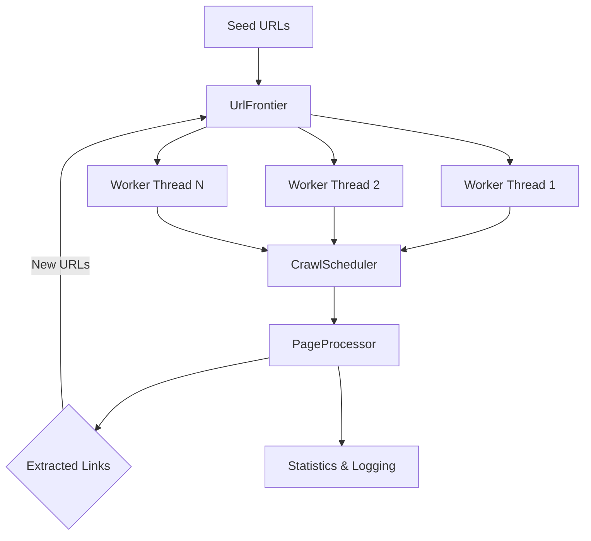

    █████╗ ███╗   ██╗██╗   ██╗██╗███████╗███████╗ █████╗ ██╗  ██╗
   ██╔══██╗████╗  ██║██║   ██║██║██╔════╝██╔════╝██╔══██╗██║ ██╔╝
   ███████║██╔██╗ ██║██║   ██║██║███████╗█████╗  ███████║█████╔╝ 
   ██╔══██║██║╚██╗██║╚██╗ ██╔╝██║╚════██║██╔══╝  ██╔══██║██╔═██╗ 
   ██║  ██║██║ ╚████║ ╚████╔╝ ██║███████║███████╗██║  ██║██║  ██╗
   ╚═╝  ╚═╝╚═╝  ╚═══╝  ╚═══╝  ╚═╝╚══════╝╚══════╝╚═╝  ╚═╝╚═╝  ╚═╝

                     A N V E S H A   C R A W L E R
                     (A N V E Ṣ A K A  –  Explorer)

# Web Crawler Architecture - Current State

## Status: ✅ Core Working | 🚧 Mock Data Only

---

## Architecture Overview

The web crawler is designed for scalable, prioritized, and robust crawling with multi-threaded execution. Its modular architecture enables easy extension and real-world deployment.

### **Component Breakdown**

#### 1. **WebCrawler**
- **Role:** Main orchestrator, manages threads/workers, coordinates crawling.
- **Highlights:** Launches worker threads, aggregates statistics, interfaces with CLI/config.

#### 2. **UrlFrontier**
- **Role:** Manages URLs to crawl, deduplicates, prioritizes.
- **Tech:** `BinaryHeap` for priority, `DashSet` for deduplication, thread-safe via `Arc<Mutex>`.

#### 3. **PageProcessor**
- **Role:** Parses HTML, extracts links/content.
- **Tech:** Uses `scraper` crate for DOM parsing.

#### 4. **CrawlScheduler**
- **Role:** Enforces rate limits, retry logic, domain delays.
- **Tech:** Semaphore for concurrency, per-domain timers.

#### 5. **Statistics & Logging**
- Tracks pages crawled, errors, domains, queue size, etc.

---

## **Data Flow**

Seed URLs ⟶ **UrlFrontier** ⟶ Worker Threads ⟶ **CrawlScheduler** ⟶ **PageProcessor** ⟶ New URLs ⟶ **UrlFrontier**  
                                                                               ↓  
                                                                   **Statistics Tracking**

---

## **Diagram**



---

## **Current Implementation**

### **What Works ✅**
- Multi-threaded crawling (10 workers by default)
- Priority-based URL queue (BFS strategy)
- Thread-safe: `Arc<Mutex>`, `DashSet`
- Per-domain rate limiting and retry logic
- Real-time statistics/logging
- TOML config loading
- CLI via `clap`

### **Current Limitations 🚧**
- **Mock HTTP:** `fetch_and_process_page()` uses hardcoded data
- **No real links:** Always finds 0 outgoing links
- **No database:** Pages not persisted
- **No robots.txt:** Compliance not implemented

---

## **Core Functions**

### **WebCrawler**
- `new(config)` - Initializes all components
- `start_crawling()` - Starts worker threads
- `crawler_worker()` - Worker loop (get URL, process, repeat)
- `crawl_single_page()` - Per-page processing

### **UrlFrontier**
- `add_url(url)` - Adds to queue if unseen
- `next_url()` - Gets highest priority URL
- `mark_crawled()` - Tracks completed URLs

### **PageProcessor**
- `process_page(url, html, depth)` - Extracts title, content, links
- `extract_links()` - Finds `<a>` tags, validates, prioritizes

### **CrawlScheduler**
- `schedule_crawl()` - Rate limiting, retries
- `respect_domain_delay()` - Per-domain timing

---

## **Configuration (TOML)**

```toml
[crawler]
max_pages = 1000
concurrent_requests = 10
seed_urls = ["https://example.com"]

[network]
request_delay_ms = 1000
max_retries = 3
```

---

## **How to Run**

```bash
cargo run -- crawl -s "https://example.com" -s "https://httpbin.org"
```

---

## **Next Steps**

1. Replace mock with real HTTP client (`reqwest`)
2. Integrate PageProcessor for real HTML parsing
3. Add database storage for crawled pages
4. Implement robots.txt compliance

---

## **File Structure**

```
src/
├── core/
│   ├── crawler.rs         # Main orchestrator
│   ├── url_frontier.rs    # Priority queue management
│   ├── page_processor.rs  # HTML parsing
│   └── scheduler.rs       # Rate limiting
├── models/                # Data structures
├── config/                # TOML configuration
├── utils/                 # Logging, metrics
└── main.rs                # CLI entry point
```

---

> The architecture is production-ready and modular. HTTP client integration will make the crawler fully functional for real-world use.
